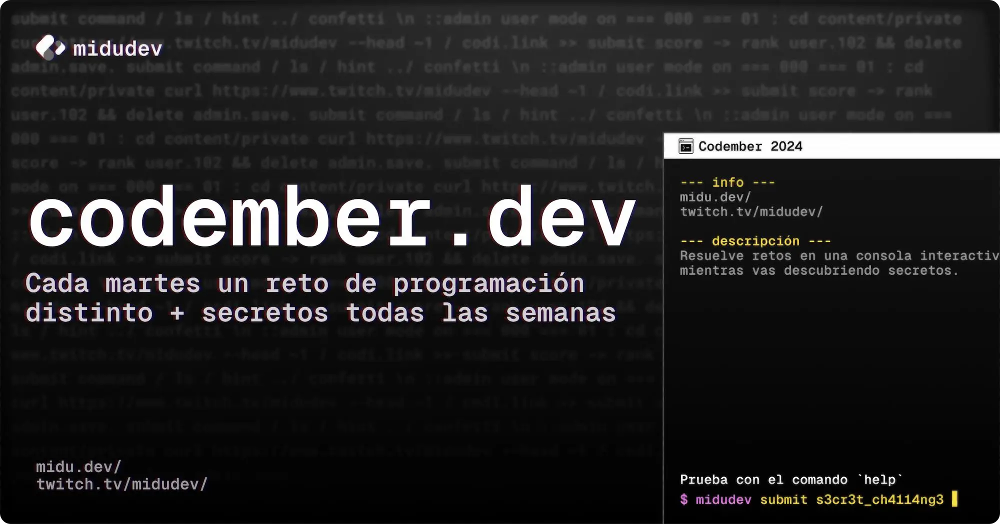

# 📗 [codember](https://codember.dev) 📗

Mis soluciones a los retos de [codember](https://codember.dev) hechos en JavaScript con NodeJS. Codember es un juego y reto de programación que se realiza en el mes de noviembre para la comunidad de [midudev](https://midu.dev). Cada semana se publica un reto que se debe resolver usando ingenio y programación.

## Retos

- [Reto 1](https://github.com/cosmoart/codember/blob/main/retos/challenge01.md)
- [Reto 2](https://github.com/cosmoart/codember/blob/main/retos/challenge02.md)
