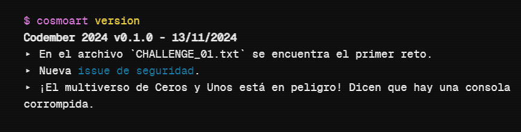

# 📗 [codember](https://codember.dev) 📗

Mis soluciones a los retos de [codember](https://codember.dev) hechos en JavaScript con NodeJS. Codember es un juego y reto de programación que se realiza en el mes de noviembre para la comunidad de [midudev](https://midu.dev). Cada semana se publica un reto que se debe resolver usando ingenio y programación.

## 2022

Retos y secretos

### Retos

- [Reto 1](https://github.com/cosmoart/codember/blob/main/2022/challenge01.md)
- [Reto 2](https://github.com/cosmoart/codember/blob/main/2022/challenge02.md)
- [Reto 3](https://github.com/cosmoart/codember/blob/main/2022/challenge03.md)
- [Reto 4](https://github.com/cosmoart/codember/blob/main/2022/challenge04.md)
- [Reto 5](https://github.com/cosmoart/codember/blob/main/2022/challenge05.md)

### Secretos

🖼️ 1) Imagen corrupta

 

Navegando por las carpetas te puedes encontrar con una imagen corrupta que puedes ver con el comando que lee archivos. En la imagen se encuentra un comando que debes completar con el nombre de la persona que aparece allí.

<!-- $ say elon musk -->
 

🮠2) La vaca

 

- La **vaca** te **dice** lo que debes hacer.
- Prueba con los nuevos comandos.
- Tony Monroe es el dueño de la vaca.

<!-- $ ping midu.dev -->
 

🊠3) Confeti

 

Un simple comando que te tira confeti.

- El que persevera alcanza.
- El que persevera alcanza.
- El que persevera alcanza.

<!-- $ confetti  --- Enviar el comando varias veces -->
 

🕹️ 4) Minijuego

 

- Un comando que se encuentra en la lista de ayuda (help) te da una pista.
- Es un juego famoso que salio para la Game Boy.
- Consta de dos palabras: `___ ___`.

<!-- $ play tetris --- Con llenar una linea horizontal basta -->
 

🛢️ 5) Rick roll

 

- Usa el comando `do` con tres parametros: `do ___ ___ ___`.
- Es una frase icónica de un juego de la Nintendo 64.
- La frase tiene sentido, por ejemplo: `do a task now`.
- La relación con el [rick roll](https://www.youtube.com/watch?v=dQw4w9WgXcQ) es que el comando incluye una palabra de este.
- Es un easter egg en Google.

<!-- $ do a barrel roll -->
 

🭠6) Somos legión

 

- Tienes un nuevo mensaje, puedes leerlo con el nuevo comando.
- Puedes obtener ayuda poniendo el nuevo comando con el parametro `--help`: `___ --help`.
- "109105100117" -> midu

<!-- submit t8vjh832948fcnal -->
 

👽 7) Contra

 

- En el juego _Contra_, había varios trucos que hacían el juego más fácil.
- Por ejemplo, hacer `Círculo, L1, Izquierda, R1, L2, X, R1, L1, Círculo, X` en _GTA V_ te da un coche de golf.
- No es necesario enviar un comando.

<!-- ⬆️, ⬆️, ⬇️, ⬇️, ⬅️, ➡️, ⬅️, ➡️, B, A  -->

 

📦 8) npm run init

 

- Ahora se puede acceder a la carpeta `public` con el comando.
- Escribe los comandos sin abreviarlos.

<!-- submit bug -->

 

 
 

**_IMPORTANTE:_**

- Todos los comandos deben estar en inglés.
- En el archivo `CHANGELOG.md` puede haber pistas extra.

## 2023

Retos y secretos

### Retos

- [Reto 1](https://github.com/cosmoart/codember/blob/main/2023/challenge01.md)
- [Reto 2](https://github.com/cosmoart/codember/blob/main/2023/challenge02.md)
- [Reto 3](https://github.com/cosmoart/codember/blob/main/2023/challenge03.md)
- [Reto 4](https://github.com/cosmoart/codember/blob/main/2023/challenge04.md)
- [Reto 5](https://github.com/cosmoart/codember/blob/main/2023/challenge05.md)

### Secretos

👽 1) Contra

 

- En el juego de la NES _Contra_ había varios trucos que hacían el juego más fácil, tienes que ejecutar uno de ellos.
- Por ejemplo, hacer `Círculo, L1, Izquierda, R1, L2, X, R1, L1, Círculo, X` en _GTA V_ te da un coche de golf.
- No es necesario enviar un comando, solo hacer una combinación de teclas.
- En _Contra_ este truco te daba 30 vidas.

<!-- ⬆️, ⬆️, ⬇️, ⬇️, ⬅️, ➡️, ⬅️, ➡️, B, A  -->
 

🧑🏻‍🦲 2) Say my name

 

- Usa los comandos para moverte entre carpetas y leer archivos. (Usa el comando `help` para obtener una lista de los comandos disponibles).
- La persona es el CEO de una importante empresa de hosting que empieza con V y termina con l.
- `name` No es lo mismo que `last-name`

<!-- $ submit rauch -->
 

📅 3) La fecha especial

 

- Tienes un nuevo email, puedes ver tus emails con el comando `mail`.
- Para leer un email usa el comando `mail <id>`.
- Recuerda usar el formato correcto para la fecha.

<!-- $ submit 2023-12-01 -->
 

🊠4) Confeti

 

- Puedes leer el archivo `CHANGELOG.txt` para obtener información de la nueva versión.
- El que persevera alcanza.

<!-- $ confetti  --- Enviar el comando varias veces -->
 

🪄 5) Magia!

 

- Puedes leer el archivo `CHANGELOG.txt` para obtener información de la nueva versión.
- Es solo una palabra, en minúsculas.
- Existe una película de Disney con el mismo nombre.

<!-- $ submit itsmagic -->
 

🟧 6) Adivinanza

 

- Tienes un nuevo email, puedes ver tus emails con el comando `mail`.
- Para leer un email usa el comando `mail <id>`.
- Debes enviarlo con el comando submit: `submit <respuesta>`.

<!-- $ submit html -->
 

🛢️ 7) Giro de barril

 

- Puedes leer el archivo `CHANGELOG.txt` para obtener información de la nueva versión.
- Usa el comando `do` con tres parametros: `do ___ ___ ___`.
- La frase tiene sentido, por ejemplo: `do a task now`.
- El comando es en inglés.
- Es una frase icónica de un juego de la Nintendo 64.
- Es un easter egg en Google.

<!-- $ do a barrel roll -->
 

🧑‍🚀 8) Astronauta

 

- Para este secreto necesitas acceder a la carpeta `private`. El *mail* numero 3 te dice como acceder.
- En la carpeta `private` podrás leer el archivo `log_mars_mission.txt` con el comando cat: `cat log_mars_mission.txt`.

<!-- $ submit majortom -->
 

🧑🏻‍🦲 9) Say my last name

 

- Para este secreto necesitas acceder a la carpeta `private`. El *mail* numero 3 te dice como acceder.
- En la carpeta `private` podrás ver la imagen `ai.webp` con el comando cat: `cat ai.webp`.
- La persona **era** el CEO de una importante empresa de IA que empieza con O y termina con a.
- La persona ha sido noticia recientemente debido a su despido.
- `name` No es lo mismo que `last-name`

<!-- submit Altman -->
 

🄠10) La vaca dice

 

- Puedes leer el archivo `CHANGELOG.txt` para obtener información de la nueva versión.
- Tienes un nuevo email, puedes ver tus emails con el comando `mail`.
- La **vaca** te **dice** lo que debes hacer.
- Es un solo comando formado por dos palabras juntas en inglés.
-	Referencia a un famoso paquete de npm.

<!-- cowsay -->
<!-- submit ping -->
 

🐞 11) La adivinanza final

 

- Tienes un nuevo email, puedes ver tus emails con el comando `mail`.
- Para leer un email usa el comando `mail <id>`.
- Es una palabra en inglés de 3 letras.

<!-- submit bug -->
 

👾 12) Tetris

 

- Puedes leer el archivo `CHANGELOG.txt` para obtener información de la nueva versión.
- Completa una linea.

<!-- play tetris -->
<!-- Con llenar una linea horizontal basta -->
 

🪠13) Marte

 

- Para este secreto necesitas acceder a la carpeta `private`. El *mail* numero 3 te dice como acceder.
- En la carpeta `private` podrás leer el archivo `final_log_mars_mission.txt` con el comando cat: `cat final_log_mars_mission.txt`.
- Busca el comando en el texto.
- Son tres palabras: `___ ___ ___`.

<!-- npm install adventjs -->
 

## 2024

Retos y secretos

### Retos

- [Reto 1](https://github.com/cosmoart/codember/blob/main/2024/challenge01.md)
- [Reto 2](https://github.com/cosmoart/codember/blob/main/2024/challenge02.md)

### Secretos

🌌 1) ¡Multiverso a salvo!

 

- Presta atención al ultimo texto que da el comando `version` 
- Decodifica en Base64
- La fecha te la da el comando `version`

 

🔥 2) ¿Todo estará bien?

 

- Navegando por las carpetas te puedes encontrar con la imagen "image.webp".
- Usa los comandos `ls`,`cd` y `cat` para moverte entre carpetas y leer archivos.

 

👽 3) Contra

 

`/hint - Pista #02`
- En el juego de la NES *Contra* había varios trucos que hacían el juego más fácil, tienes que ejecutar uno de ellos.
- Por ejemplo, hacer Círculo, L1, Izquierda, R1, L2, X, R1, L1, Círculo, X en GTA V te da un coche de golf.
- No es necesario enviar un comando, solo hacer una combinación de teclas.
- En Contra este truco te daba 30 vidas.

 

📷 4) Observador Innato

 

`/hint - Pista #05`
- Para compartir codember.dev usa el comando `share`.

 

🊠5) Confetti lanzado

 

`/hint - Pista #02`

 

👨‍💻 6) Hacker eliminado

 

- Usa el comando `sudo` para iniciar sesión como administrador.
- Elimina al hacker que va ganando.

 

 

## Más retos

<table align="center">
	<thead>
		<tr>
			<th>
				
			</th>
			<th>
				
			</th>
			<th>
				
			</th>
		</tr>
	</thead>
</table>
